<!-- Banner -->

# Nidhi Vishwakarma

### B.Tech CSE (AI & Data Science) @ SATI Vidisha | ML Engineer | GNN & LLM Enthusiast

Welcome to my GitHub profile! I'm Nidhi, an Artificial Intelligence and Data Science engineering student with hands-on experience designing, training, and deploying end-to-end machine learning pipelines, graph neural networks (GNNs), and LLM agent workflows. I love building production-grade AI systems, from physics-informed material risk engines to real-time fraud detection on imbalanced data.

---

## 📊 GitHub Stats

---

## 🚀 Top Projects

### 🔬 [MatRisk AI](https://github.com/Nidhi-24-eng/MatRisk-AI-): Physics-Informed AI Engine
- Architected a physics-informed AI engine bridging **material science and financial risk** using PyTorch.
- Designed a **Dual-Attention Crystal Graph Neural Network (CGNN)** to predict elastic and fracture properties.
- Modeled crack growth under stress with **Itô Stochastic Differential Equations (SDEs)**.
- Shipped **FastAPI** microservices in Docker, covered by **Pytest** suites.
- Built interactive **Streamlit** dashboards for real-time risk evaluation and degradation curves.

`PyTorch` `Python` `GNN` `SDEs` `FastAPI` `Docker` `Pytest` `Streamlit`

### 🛡️ [Golden Hour Hold](https://github.com/Nidhi-24-eng/Golden-hour-defense): Real-Time Fraud & Money Mule Detection
- Engineered an enterprise-grade banking security pipeline to detect **money mule accounts in real time**.
- Built multi-relational graphs with **PyTorch Geometric** linking device identifiers and proxy IP connections.
- Optimized preprocessing with **Polars LazyFrame** pipelines for higher throughput.
- Trained an **XGBoost** behavioral ensemble on imbalanced data: **ROC-AUC 0.9286** and **Precision@50 of 74%**.
- Deployed reproducible ML execution pipelines with automated inference.

`PyTorch Geometric` `XGBoost` `Polars` `Graph ML` `Fraud Detection`

---

## 🛠️ IDE & Tools

---

## 💡 Skills

### Languages

### Machine Learning & Data Science

### Generative AI & NLP

### MLOps & Deployment

### Databases & Analytics

### Annotation Tools

---

## 📫 Let's Connect

I'm open to internships, collaborations, and open-source work in **ML, graph learning, and LLM applications**.

📧 **nidhivishwakarma066@gmail.com** &nbsp;|&nbsp; 💼 [LinkedIn](https://www.linkedin.com/in/nidhi-vishwakarma-a892b233a/)

